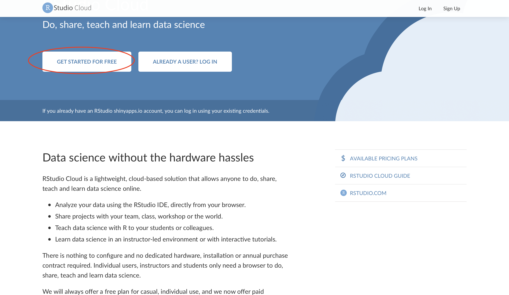
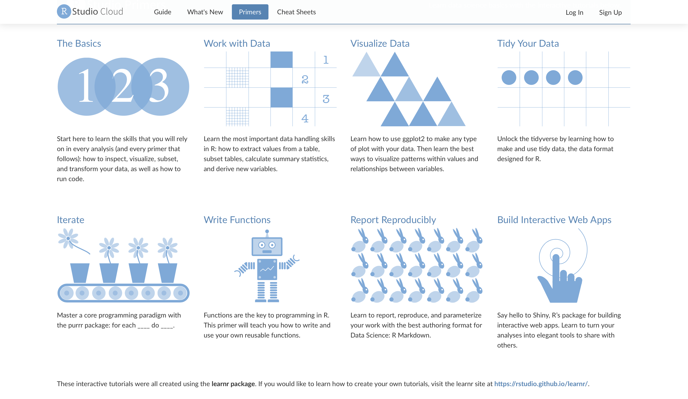

```{r setup, include=FALSE}
knitr::opts_chunk$set(echo = FALSE)
```
# Overview
This workshop is designed for young public health post-graduate students and professionals. We will work together on dataset created from fact sheets of latest National Family Health Survey i.e. NFHS-5 as well as previous surveys and learn creating visualizations with R software and R Studio. Participant is not expected to have any prior knowledge of R/R-Studio.  

Our objective is to introduce you the basic visualization principles, different types of visualizations and how these can be created in R/R-Studio so that you get the requisite motivation for further self-exploration in the world of data visualization.  

This workshop will be hosted on R Studio Cloud workspace where we will concurrently work on the day of workshop. We will also provide an interactive tutorial for practice after the workshop as well as links to useful resources. We expect that, at the end of the session, each participant will be able to create at least basic visualizations.  


## Preparation for the workshop
- We are using RStudio Cloud platform to save time spent on installation of R and RStudio. 

- Participants are therefore requested to create an account on RStudio Cloud https://rstudio.cloud
- Register for **Cloud Free** plan

```{r rscloud, echo=FALSE, out.width="80%"}

```
- A link to join the project workspace will be shared on the day of workshop. You will have to log in with your RStudio Cloud username and password at that time.
- Once you are registered on RStudio Cloud, you may go through [Primers](https://rstudio.cloud/learn/primers) which are very good learning resources. We encourage you to at least go through [The Basics](https://rstudio.cloud/learn/primers/1.1)

```{r primers, echo=FALSE, out.width="80%"}

```
- Although, workshop will be held on RStudio Cloud, please install [R for Windows](https://cran.r-project.org/bin/windows/base/) or [R for Mac](https://cran.r-project.org/bin/macosx/) and [RStudio IDE](https://rstudio.com/products/rstudio/download/) on your laptop/desktop. These may be required if there is some glitch with cloud computing.


## Workshop Schedule
- Presentation- Principles of Data Visualization
- Presentation- Understanding Grammer of Graphics (Demo-Plotting layer by layer)
- Presentation- Familiarization with RStudio IDE
- Visualization Exercise-1- Interactive tutorial on creating basic plot 
- Visualization Exercise-2- Interactive tutorial on creating bar charts and variants
- Visualization Exercise-3- Interactive tutorial on creating charts to visualize trends 
- Questions & Answers


